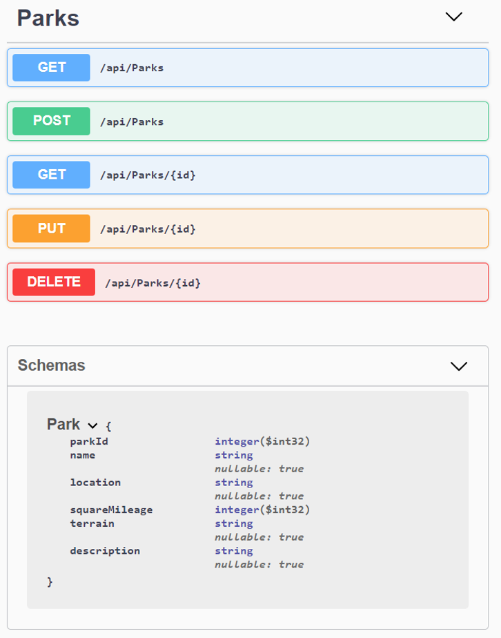

# _Parks API_

#### _An API for state and national parks, 1 Nov 2019_

#### By _**Jacqueline Remmel**_

## Description

_The purpose of this project was to practice building an API with full CRUD (create, read, update, and delete) functionality for state and national parks. Parks can be searched by name, location, terrain, and description._

## Setup/Installation Requirements

* _Clone this repository_
* _Navigate to the main directory, "ParksLookup"_
* _Navigate to the API project directory, "Parks"_
* _Run the command "dotnet restore"_
* _Run the command "dotnet ef database update"_
* _Run the command "dotnet watch run"_
* _To visit Swagger documentation, go to the URL "http://localhost:5000/swagger/" in a browser_
    * _GET request URL to get all parks: http://localhost:5000/api/Parks_
    * _Example GET request URL to search for the park with the ID of 1: http://localhost:5000/api/Parks/1_
    * _Example GET request URL to search for Yellowstone National Park: http://localhost:5000/api/Parks?name=Yellowstone_
    * _Example GET request URL to search for "mountain" in the terrain field and "Alaska" in the location field: http://localhost:5000/api/Parks?location=Alaska&terrain=mountain_

  

## Technologies Used

_C#, ASP.NET Core MVC, MySQL, Entity, Swashbuckle/Swagger_

### License

*Open-source*

Copyright (c) 2019 **_Jacqueline Remmel_**